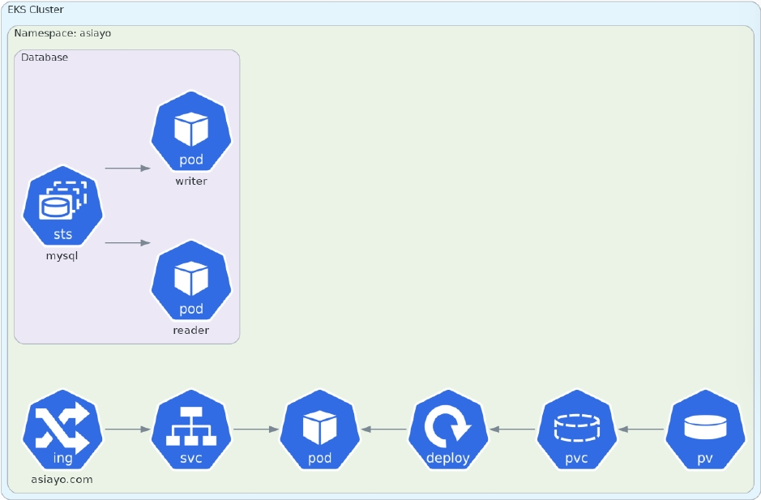

# Q2

## Question
試想有一服務架構圖如下


作答要求：
● 請使用terraform 架設如上述的AWS Elastic Kubernetes Service (EKS)
的cluster 服務。
● 請撰寫如圖中，適用於 k8s 的應用程式服務manifest 設定檔。
● 設計時，請考量以高可用性為主。

## Answer

### 說明

- Terraform 結構
terraform/
├── backend.tf             # 設定 Terraform backend 存放位置
├── main.tf                # 主要的 Terraform 配置檔案
├── output.tf              # 輸出 terraform 輸出值
├── providers.tf           # 設定 Providers
├── variables.tf           # 定義變數
├── versions.tf            # Terraform 版本 & Provider 限制
├── modules/               # 模組
│   ├── vpc/               # VPC 相關資源
│   │   └── main.tf
│   │   ├── variables.tf   # 定義變數
│   ├── eks/               # EKS 叢集
│   │   └── main.tf
│   │   ├── variables.tf   # 定義變數
└── terraform.tfvars       # 設定具體環境變數

### formatting

```shell
terraform fmt -recursive
```
