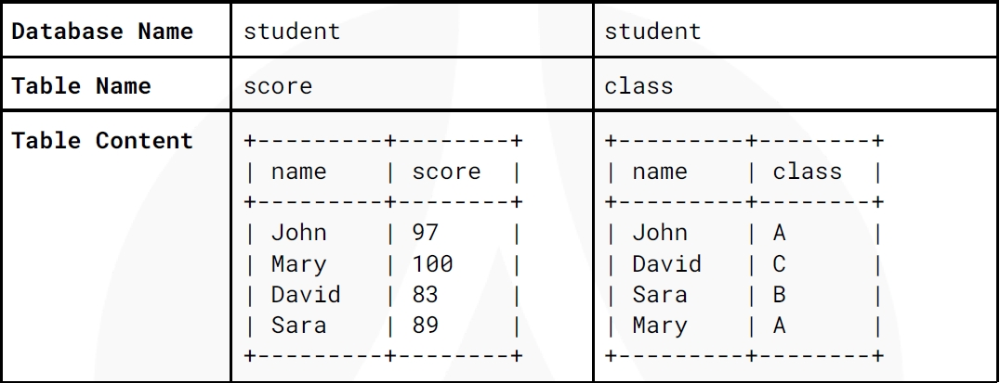

# Q3

## Question
試想有一資料庫，用來紀錄學生成績與班級資訊，內容如下：


請寫出找出分數排名第二名學生所在的班級的SQL 描述句

## Answer

### 假設是使用 MySQL
```sql
SELECT class
FROM class
WHERE name = (
    SELECT name
    FROM score
    ORDER BY score DESC
    LIMIT 1 OFFSET 1
);
```
### 說明
- SELECT class FROM class WHERE name = (...)，透過 name 查詢對應的 class
- LIMIT 1 OFFSET 1 代表跳過第一名，取 排名第二的學生


### 假設是使用 MSSQL

```sql
SELECT class
FROM class
WHERE name = (
    SELECT name
    FROM score
    ORDER BY score DESC
    OFFSET 1 ROW FETCH NEXT 1 ROW ONLY
);
```
### 說明
- OFFSET 1 ROW：跳過第一行 (最高分的學生)
- FETCH NEXT 1 ROW ONLY：取得下一行，即第二名的學生

ref: https://stackoverflow.com/questions/2135418/equivalent-of-limit-and-offset-for-sql-server